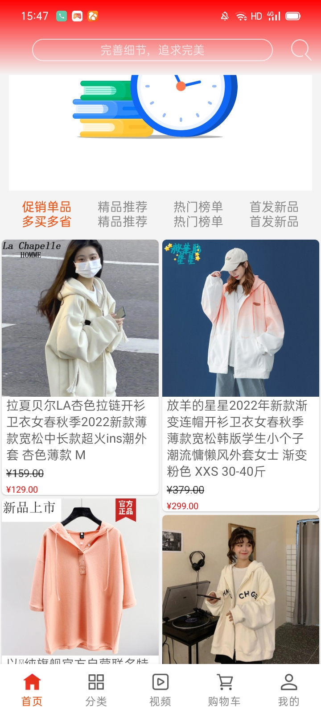
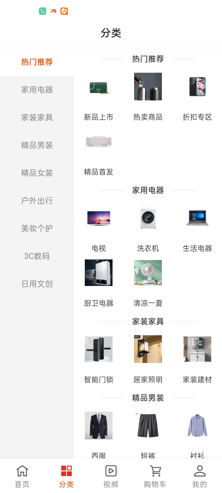
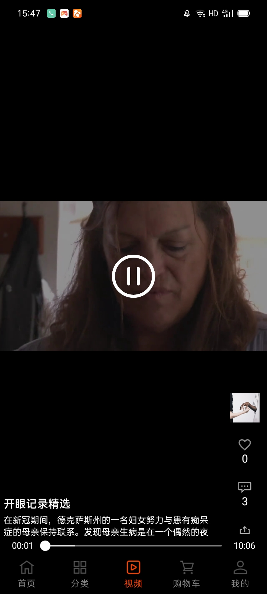
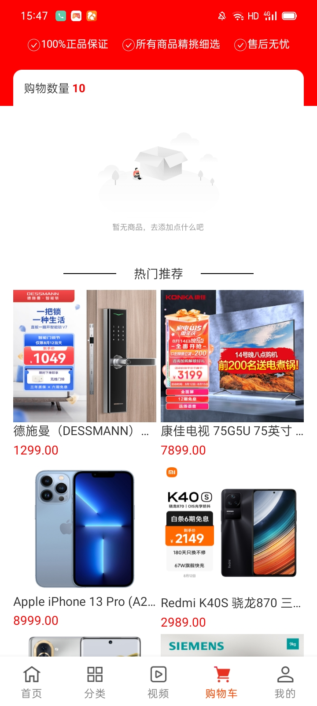
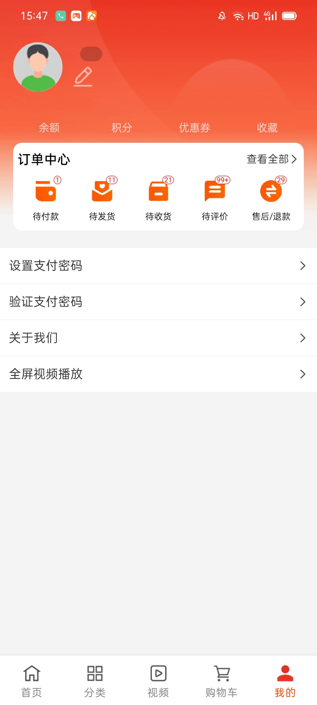

## 项目说明

基于 [Kotlin][1] 语言 编写商城类 +「[开眼短视频][2]」组合的 Android 客户端项目，采用 Android组件化,[Jetpack][3] + [协程][4]实现的 MVVM
架构。

## 下载地址

## 项目效果
首页|分类|视频|购物车|我的
|:-:|:-:|:-:|:-:|:-:|
||||||

<video src="pic/24_1671090689.mp4"></video>
<iframe height=498 width=510 src="pic/24_1671090689.mp4">

[1]:https://kotlinlang.org

[2]:https://www.kaiyanapp.com

[3]:https://developer.android.com/jetpack

[4]:https://github.com/Kotlin/kotlinx.coroutines
